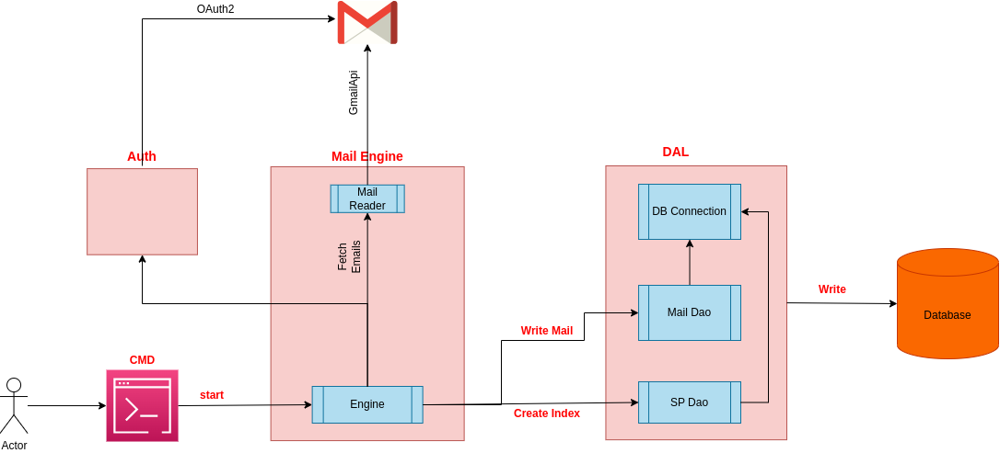
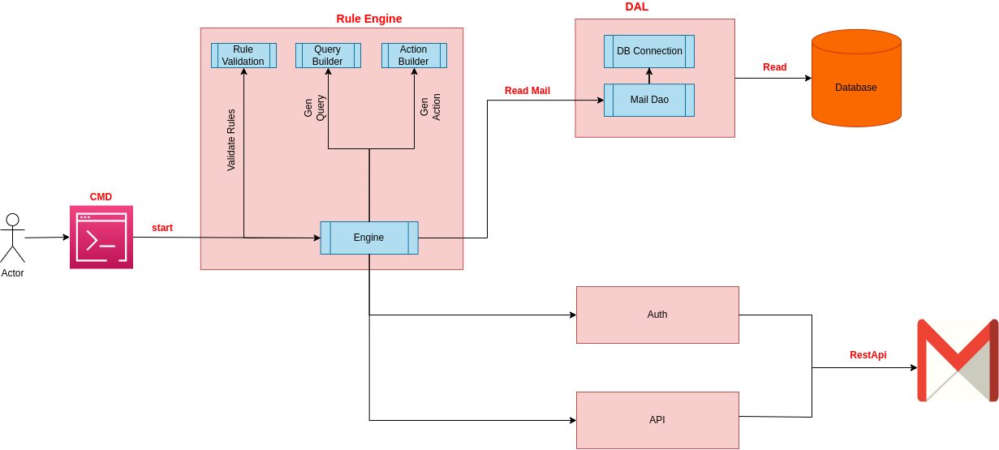

<a name="readme-top"></a>

<!-- [![Contributors][contributors-shield]][contributors-url] -->
[![Forks][forks-shield]][forks-url]
[![Stargazers][stars-shield]][stars-url]
[![License][license-shield]][license-url]
[![LinkedIn][linkedin-shield]][linkedin-url]

<!-- PROJECT LOGO -->
<br />
<div align="center">
  <a href="https://github.com/vyavasthita/mail-integration">
    
  </a>

  <h3 align="center">Mail Integration</h3>

  <p align="center">
    Mail Integration Project!
    <br />
    <a href="https://www.loom.com/share/ea483f1e7d274f8788617b3afae9a534?sid=7a798ff1-7e68-409e-8fe6-96a24e03c0e1"><strong>View Video Presentation»</strong></a>
    <br />
  </p>
</div>

<p align="right">(<a href="#readme-top">Back To Top</a>)</p>

# About the project
This project integrates with Gmail API and performs some rule based operations on emails.

Details:
* This project has been implemented using Python.
* This project lets user fetch gmails from a gmail account using official gmail api.
* These emails data and metadata are stored in Mysql database.
* User can apply filters and take action on these emails, say to move email to different label, by updating rules defined in a JSON file.

It uses google rest api
Ref: https://developers.google.com/gmail/api/reference/rest

<p align="right">(<a href="#readme-top">Back To Top</a>)</p>

## Built With

Softwares/libraries used in this project.

* [![Python][Python]][Python-url]
* [![Docker][Docker]][Docker-url]
* [![Docker Compose][Docker]][Docker-Compose-url]
* [![Makefile][Makefile]][Makefile-url]

<p align="right">(<a href="#readme-top">Back To Top</a>)</p>

## :hammer: Testing
### System Environment
- OS - Ubuntu 22.04
- Docker Compose version v2.17.3
- Docker version 23.0.6
- GNU Make 4.3
- Mysql 8.0.29
- Python 3.10

### Assumptions
- Before using the application, user is going to enable gmail api from google workspace and download the credentials. 
- User is going to allow readonly and modify permissions in gmail api to let this application read and write data to email.
These permissions are defined like this.
```
"https://www.googleapis.com/auth/gmail.readonly",
"https://www.googleapis.com/auth/gmail.modify"
```
- We can not have multiple rules (with same field) defined in json file.
  e.g. we can not have two 'From' fields in our json rules.
- Every time we run the script to fetch the emails, we download all requested emails.
- Everytime we run the script to apply rules, we overwrite the labels in gmail.
- As email rules in json are not validated, it is assumed user is going to put correct details in rules json file.

### Scope
- Tested with docker environment only on Ubuntu 22.04 LTS host system.
- Tested with single gmail account only.
- Tested with maximum 250 emails only.
- Tested with english language search only.
- Tested without special characters search.
- Tested against Mysql InnoDB engine only.
- Tested with root user of mysql db.
- Tested auth flow with chrome browser only.
- Not all labels types have been tested. 
  There could be some limitations in gmail by moving a message to a particular label. For example, if we try to move message to 'CHAT' label (Even though CHAT is a valid label name), then it does not work and we get HTTP response 400 (BAD REQUEST). I could not find relevant documentation on rules of applying labels to email.
  There could be more such scenario. And I have not tested all of such permutations and combinations as it requires understanding gmail api in detail which requires more time. 

<p align="right">(<a href="#readme-top">Back To Top</a>)</p>

### Email Rules
- I have created one email_rules.json file having all rules to apply and the actions
  to take on those rules.

- We can fetch emails by providing list of labels in config/<environment>/email_rules.json

- User can edit this rules file by modifying it or adding or removing rules and actions.

### :pencil: Notes

Important points about this email_rules.json file;-

1. Field

- All the fields under condition have been given a particular code.
  User must use the intended code before running the application.

Json path -> root/conditions/{condition}/field

| Field | Code |
| --- | --- |
| `From` | **1** |
| `To` | **2** |
| `Subject` | **3** |
| `Message` | **4** |
| `Date Received` | **5** |

2. Predicate

- All the predicate under condition have been given a particular code.
  User must use the intended code before running the application.

Json path -> root/conditions/{condition}/predicate

| Predicate | Code |
| --- | --- |
| `Contains` | **1** |
| `Does not contain` | **2** |
| `Equals` | **3** |
| `Does not Equal` | **4** |
| `Is less than` | **5** |
| `Is greator than` | **6** |

3. Action

- All the actions have been given a particular code.
  User must use the intended code before running the application.

Json path -> root/actions/{action}

| Action | Code |
| --- | --- |
| `Move` | **1** |
| `Read` | **2** |
| `Unread` | **3** |

<p align="right">(<a href="#readme-top">Back To Top</a>)</p>

### Validations done
Application will exit on following conditions.
- If invalid command line arugment is passed
- Application is not connected to database.
- Authentication fails.

<p align="right">(<a href="#readme-top">Back To Top</a>)</p>

## Design Goals
### Multiple build environments
An application should support multiple build environments which should be completely independent to each other.

I have added support for multiple build environments.
- development
- qa
- production

We can switch between multiple environment sjust by exporting an environment variable. It's so easy.

  ```
  export BUILD_ENV development
  ```
  or
  ```
  export BUILD_ENV qa
  ```
  or
  ```
  export BUILD_ENV production
  ```
<p align="right">(<a href="#readme-top">Back To Top</a>)</p>

### Independent Components
Application should be divided into multiple small components which do one particular task.
This application is divided into few small components.

1. **Mail Engine**
  - Connects with gmail api.
  - Fetches email content.
  - Parses email content.
  - Writes email content to database.



2. **Rule Engine**
  - Reads selected rule from rules.
  - Generates Query based on rules.
  - Generates Actions based on rules.
  - Reads data from database based on query.
  - Updates Mail Server through RestAPIs.



3. **Api**
  - Connects with gmail api over REST.
  - Update email label.

4. **Auth**
  - Authenticates to gmail using Oauth2.

5. **data_layer**
  - Data Access layer between other python components and database.
  - All communication to database happens through this layer.

6. **utils**
  - Utility functions common to all other modules.

7. **config**
  - Reads configuration data which is shared across application.

<p align="right">(<a href="#readme-top">Back To Top</a>)</p>

### Simplicity
- Source code and Database table structure should be less complex or say should be simple to understand.
- I have followed all possible best practices to make code structure simple.

### Design Patterns
- Single Responsibility design pattern of SOLID principle is followed.
- Each class does one thing only.
- Singletone design pattern is followed for python logging.

### Flexible
- Ability of the application to adapt and evolve to accommodate new requirements without affecting the existing operations. 
- This application is modularized into small python modules which allow us to add new requirements or modify existing ones.

### Readable and Understandable
- Software is meant for modification/improvements. Fellow developers should be able to understand the code.

- This could be achieved by
    • Coding guidelines.
    • Comments/Description of classes and methods used.
    • Documentation (Doc string comments in Python), README document.

<p align="right">(<a href="#readme-top">Back To Top</a>)</p>


## :art: Best Practices
#### :white_check_mark: Use of Makefile to ease running various commands
#### :white_check_mark: Docker with docker compose used
#### :white_check_mark: Different configurations for differnent environments like Dev, test, QA, Production
#### :white_check_mark: Manual steps are minimal while testing the app. Make file and docker compose help us in achieving this
#### :white_check_mark: Proper directory and file structure of source code
#### :white_check_mark: Applicationi is modularized into small logical components.
#### :white_check_mark: Use of context manager for db connection, gmail authentication
#### :white_check_mark: Use of decorators, dataclasses
#### :white_check_mark: Use of environment variables
#### :white_check_mark: DB transactions are used while inserting data into database support Atomicity
#### :white_check_mark: Poetry for managing different run environments
#### :white_check_mark: Normalized DB Schema with Full text search index for pattern matching
#### :white_check_mark: For code formatting black and flake8 packages are used. 
#### :white_check_mark: Python Logging - Console and File with proper log level
#### :white_check_mark: Use of exception handling
#### :white_check_mark: Doc string added for all modules and methods
#### :white_check_mark: Type annotations are added for all methods
#### :white_check_mark: Unit tests with coverage report
#### :white_check_mark: Proper git commit messages. Every commit is done post completing a functionality
#### :white_check_mark: Pep8 naming convention for modules, classes, methods, functions and variables
#### :white_check_mark: Comments added wherever required
#### :white_check_mark: Python Logging
#### :white_check_mark: Import statements are in order
Python core -> Third party -> Application modules
#### :white_check_mark: Detailed README file

<p align="right">(<a href="#readme-top">Back To Top</a>)</p>

## Issues and Limitations
  1. While parsing emails, only the message snippet is used not the complete body. 
    This snippet is only the first 200 characters from the message body. 
    Due to this some of the emails may not get filtered where field type is 'message'.
    This limitation is due to the fact that message body may content images, htmls, text with any such combination.
    Understanding this required more time and hence I did not implement this feature.

  2. Downloading emails consuming lots of time. Hence performance is not good.
    Few options are available for performance improvement.
    - We might need to run multiple threads here to download bulk emails.
    - Need to improve performance by using google async api named 'aiogoogle'.

  3. When we apply move to INBOX action on a message, which is currently under CATEGORY_PROMOTIONS label,
     then it fails. For this to work we need to also remove CATEGORY_PROMOTIONS label from that message. This particular message had other labels also but only we need to remove this CATEGORY_PROMOTIONS label to move it to INBOX. I did not implement this check because
     I did not find clear explanation on this on any of google api documentation. And if I had applied something based on assumptions,
     then something else would have broken. Now there could be other similar condition.

  4. Email rules json file is not validated and if invalid data is present, we will get unexpected results.

  5. Database tables could be designed better.

<p align="right">(<a href="#readme-top">Back To Top</a>)</p>

## :large_orange_diamond: Technical Details

### Python Packages
```
Name: python-dotenv
Purpose: To read environment variables from .env files
Environment: All (development, qa, production etc.)

Name: google-api-python-client
Purpose: For gmail api
Environment: All (development, qa, production etc.)

Name: google-auth-httplib2
Purpose: For gmail api
Environment: All (development, qa, production etc.)

Name: google-auth-oauthlib
Purpose: For gmail api
Environment: All (development, qa, production etc.)

Name: BeautifulSoup4
Purpose: For decoding email body
Environment: All (development, qa, production etc.)

Name: lxml
Purpose: For decoding email body
Environment: All (development, qa, production etc.)

Name: mysql-connector-python
Purpose: To connect with mysql
Environment: All (development, qa, production etc.)

Name: dateutil
Purpose: To find date format of gmail datetime
Environment: All (development, qa, production etc.)

Name: black
Purpose: Python code formatting
Environment: development

Name: flake8
Purpose: Python code linting
Environment: development

Name: pytest
Purpose: Write automated tests
Environment: test

Name: pytest-cov
Purpose: Automated tests coverage
Environment: test

Name: pytest-mock
Purpose: To mock objects and functions
Environment: test

Name: requests-oauthlib
Purpose: OAuth2 for restapi using requests
Environment: All (development, qa, production etc.)

Name: requests
Purpose: Restapi using requests
Environment: All (development, qa, production etc.)
```

<p align="right">(<a href="#readme-top">Back To Top</a>)</p>

### DB Schema
```
CREATE TABLE IF NOT EXISTS label(  
    label_id varchar(25) NOT NULL,  
    name varchar(45) NOT NULL,  
    PRIMARY KEY (label_id)  
);

CREATE TABLE IF NOT EXISTS email(  
    message_id varchar(25) NOT NULL,
    is_read BOOLEAN,
    INDEX (is_read),
    PRIMARY KEY (message_id)
);

email_sender(  
    message_id varchar(25) NOT NULL,
    sender varchar(255) NOT NULL,
    PRIMARY KEY (message_id),
    FOREIGN KEY (message_id) REFERENCES email(message_id),
    FULLTEXT (sender)
);

email_receiver(  
    message_id varchar(25) NOT NULL,
    receiver varchar(255) NOT NULL,
    PRIMARY KEY (message_id),
    FOREIGN KEY (message_id) REFERENCES email(message_id),
    FULLTEXT (receiver)
);

email_subject(  
    message_id varchar(25) NOT NULL,
    subject varchar(255) NOT NULL,
    PRIMARY KEY (message_id),
    FOREIGN KEY (message_id) REFERENCES email(message_id),
    FULLTEXT (subject)
);

email_content(  
    message_id varchar(25) NOT NULL,
    content MEDIUMTEXT NOT NULL,
    PRIMARY KEY (message_id),
    FOREIGN KEY (message_id) REFERENCES email(message_id),
    FULLTEXT (content)
);

email_date(  
    message_id varchar(25) NOT NULL,
    received date NOT NULL,
    PRIMARY KEY (message_id),
    INDEX (received),
    FOREIGN KEY (message_id) REFERENCES email(message_id)
);
```
<p align="right">(<a href="#readme-top">Back To Top</a>)</p>

### Source Code Folder Structure

```bash
|-- Dockerfile.dev
|-- Dockerfile.prod
|-- Dockerfile.qa
|-- LICENSE.txt
|-- Makefile
|-- README.md
|-- configuration
|   |-- development
|   |   |-- app_config.json
|   |   |-- email_rules.json
|   |   `-- logging.conf
|   |-- production
|   |   |-- app_config.json
|   |   |-- email_rules.json
|   |   `-- logging.conf
|   `-- qa
|       |-- app_config.json
|       |-- email_rules.json
|       `-- logging.conf
|-- credentials.json
|-- database
|   |-- development
|   |   |-- data [error opening dir]
|   |   `-- sqls
|   |       |-- app_dev.sql
|   |       `-- test_dev.sql
|   |-- production
|   |   |-- data [error opening dir]
|   |   `-- sqls
|   |       |-- app_production.sql
|   |       `-- test_production.sql
|   `-- qa
|       |-- data [error opening dir]
|       `-- sqls
|           |-- app_qa.sql
|           `-- test_qa.sql
|-- docker
|-- docker-compose.dev.yaml
|-- docker-compose.prod.yaml
|-- docker-compose.qa.yaml
|-- entrypoint.sh
|-- images
|   |-- logo.png
|   |-- mail_engine.png
|   |-- mail_engine.xml
|   |-- rule_engine.png
|   `-- rule_engine.xml
|-- mail_helper.py
|-- poetry.lock
|-- poetry.toml
|-- pyproject.toml
|-- pytest.ini
|-- src
|   |-- __init__.py
|   |-- api
|   |   |-- __init__.py
|   |   |-- api_request.py
|   |   `-- http_status.py
|   |-- auth
|   |   |-- __init__.py
|   |   |-- auth.py
|   |   |-- connection.py
|   |   `-- gmail_auth.py
|   |-- config
|   |   |-- __init__.py
|   |   |-- app_config.py
|   |   `-- env_config.py
|   |-- data_layer
|   |   |-- __init__.py
|   |   |-- db_connection.py
|   |   |-- db_validation.py
|   |   |-- mail_dao.py
|   |   `-- sp_dao.py
|   |-- initialize.py
|   |-- mail_engine
|   |   |-- __init__.py
|   |   |-- mail_data.py
|   |   |-- mail_data_builder.py
|   |   |-- mail_engine.py
|   |   `-- mail_reader.py
|   |-- rule_engine
|   |   |-- __init__.py
|   |   |-- action_builder.py
|   |   |-- action_data.py
|   |   |-- query_builder.py
|   |   |-- rule_engine.py
|   |   |-- rule_parser.py
|   |   `-- rule_validation.py
|   `-- utils
|       |-- __init__.py
|       |-- api_logger.py
|       |-- datetime_helper.py
|       |-- file_helper.py
|       |-- gen_credential_data.py
|       `-- json_reader.py
`-- tests
    |-- __init__.py
    |-- conftest.py
    |-- integration
    |   |-- schema
    |   |   `-- any_predicate_rules_1.json
    |   |-- test_mail_engine_fetch_emails.py
    |   `-- test_rule_engine_any_predicate_rule.py
    `-- unit
        |-- __init__.py
        |-- schema
        |   |-- any_predicate_rules.json
        |   |-- date_duration.csv
        |   |-- match_query_string.csv
        |   `-- table_column_info.csv
        `-- test_query_builder.py
```
<p align="right">(<a href="#readme-top">Back To Top</a>)</p>

<!-- Getting Started -->
# 	:toolbox: Getting Started

This projects supports multiple build environments.
1. Development
2. QA
3. Production

Follow below steps to install the app.

<!-- Prerequisites -->
## :bangbang: Prerequisites

1. Docker must be installed
2. Docker compose must be installed
3. Git Version Control
4. GNU Make
5. Before using Google APIs, you need to turn them on in a Google Cloud project.

    You can turn on one or more APIs in a single Google Cloud project.

    Follow the given page and configure gmail api and download credential.json

    * Enable Gmail Api
    ```sh
    https://console.cloud.google.com/apis/dashboard
    https://developers.google.com/gmail/api/quickstart/python
    ```

    Note: You need to provide readonly and modify access to let the application talk to gmail.

e.g. 
   ```sh
    https://www.googleapis.com/auth/gmail.readonly
    https://www.googleapis.com/auth/gmail.modify
   ```

<p align="right">(<a href="#readme-top">Back To Top</a>)</p>

<!-- Installation -->
## :gear: Installation

Install my-project with npm

1. Clone the repo
   ```sh
   git clone https://github.com/vyavasthita/mail-integration.git
   ```

2. Go to root directory 'mail-integration'.
   ```sh
   cd mail-integration
   ```

3. Checkout master branch
   ```sh
   git checkout master
   ```

<p align="right">(<a href="#readme-top">back to top</a>)</p>

Choose one the below build environments for testing;-
Steps are similar for all the environments.

## :gem: Development Build Environment
<!-- Env Variables -->
### :key: Environment Variables and Configuration

To run this project, you need to configure environment variables and configuration files

1. Set BUILD_ENV
   Set following environment variable.
   ```sh
   export BUILD_ENV=development
   ```
   #### :pencil: Default build environment is 'development' and hence if we do not set BUILD_ENV variable, we will be treated in development environment.

2. Go to directory 'configuration/development'
   ```sh
   cd configuration/development
   ```
<p align="right">(<a href="#readme-top">Back To Top</a>)</p>

3. Create .env files
    In this directory you will find two sample env files named '.env.app.sample' and '.env.test.sample'.

    From these two sample files we need to create two .env files

    a) .env.app
    This is used when running our application
    
    Rename '.env.app.sample' to '.env.app'.
    ```sh
    mv .env.app.sample .env.app
    ```

    Note: MYSQL_PASSWORD_APP's value is empty and its intentional. Keep 'MYSQL_PASSWORD_APP' blank only.

    b) .env.test
    This is used when running unit tests

    Rename '.env.test.sample' to '.env.test'.
    ```sh
    mv .env.test.sample .env.test
    ```
    Note: `MYSQL_PASSWORD_TEST` value is empty and its intentional. Keep `MYSQL_PASSWORD_TEST` blank only.
    
<p align="right">(<a href="#readme-top">Back To Top</a>)</p>

4. Update .env files
  - Update '.env.app' 
  
    Following variables in '.env.app' should be available to you as part of enabling gmail app (as mentioned in prerequisite step).

    Update values of below environments from your credential.json file which you must have download from gmail.

    ```sh
    CLIENT_ID_APP
    PROJECT_ID_APP
    AUTH_URI_APP
    TOKEN_URI_APP
    AUTH_PROVIDER_X509_CERT_URL_APP
    CLIENT_SECRET_APP
    REDIRECT_URIS_APP
    API_URL_APP
    ```
  - Update '.env.test' 
  
    Following variables in '.env.test' should be available to you as part of enabling gmail app (as mentioned in prerequisite step).

    Update values of below environments from your credential.json file which you must have download from gmail.

    ```sh
    CLIENT_ID_TEST
    PROJECT_ID_TEST
    AUTH_URI_TEST
    TOKEN_URI_TEST
    AUTH_PROVIDER_X509_CERT_URL_TEST
    CLIENT_SECRET_TEST
    REDIRECT_URIS_TEST
    API_URL_TEST
    ```

<p align="right">(<a href="#readme-top">back to top</a>)</p>

5. Update App Configuration (If required)
    In the current directory 'configuration/development' open 'app_config.json'.

    In the 'message' key, you can update 'max_email_read' and 'labels' as per your requirements.

    'max_email_read' determines how many max emails we want to fetch from gmail.
    'labels' determines which email lables we want to fetch from.

    'labels' is a list of strings.

    You probably want to keep it '[]' empty list only so that you can fetch emails from all the labels.

<p align="right">(<a href="#readme-top">back to top</a>)</p>
   
6. Update email rules json file

    All the email rules, as per the requirements, are added in a json file

    In the current directory 'configuration/development' open 'email_rules.json'.

    You can update this file as per your testing scenario.

    Some information and validation points about this file; -

    - Key 'rule' is the name of the rule, you can use any name here.

    - Key 'predicate' can have only one of the two values 'all' or 'any'. (case sensitive)

    - Under key 'conditions', you can add N number of rules by adding more json.
      Each Field has an attribute 'code' associated with it. Following are the codes associated with fields.
    ```sh
      field: From -> Code: 1
      field: To -> Code: 2
      field: Subject -> Code: 3
      field: Message -> Code: 4
      field: Date received -> Code: 5
    ```
      Application is using these code (not field names) values to determine which condition to apply. And hence while adding/updating conditions, you need to make sure the value of code is given correctly as intended otherwise unexpected result may be encountered.

      It is perfectly fine to repeat a code twice (But make sure 'code' value is same in this case). Following condition is a valid one. This is applicable when predicate value is 'any', but for predicate 'all' duplicate condition may not yield any result.

        Below rule will fetch all those emails having word 'interviews' in subject plus those rules not having 'hello' in subject.

    ```sh
        {
            "field": "Subject",
            "code": 3,
            "predicate": {
                "type": "str",
                "code": 1,
                "name": "contains",
                "value": "interviews"
            }
        },
        {
            "field": "Subject",
            "code": 3,
            "predicate": {
                "type": "str",
                "code": 2,
                "name": "Does not contain",
                "value": "hello"
            }
        }
    ```
      Note: No validation is done to check if you entered a wrong code value say 50 or -1.

<p align="right">(<a href="#readme-top">Back To Top</a>)</p>

<!-- Run -->
### :running: Start Containers

Now you are ready to start the application

1. Go back to project root directory 'mail-integration'.
   
   ```sh
   cd ../..
   ```

2. Start containers

```bash
  make all
```

This will start 3 docker containers.
- Python App
- MySql DB
- Phpmyadmin

Go to following URL to see mysql database tables and data.

```bash
  http://127.0.0.1:8080/
```

You can see, two databases will be created.
- mails_<environment_name>
- testdb_<environment_name>

<p align="right">(<a href="#readme-top">Back To Top</a>)</p>
    
<!-- Usage -->
### :eyes: Usage
#### Starting Application

This application runs as a part of command line utility.

- Use following command to start the CMD help
   ```sh
   docker exec backend-development python mail_helper.py -h
   ```
- It will print following output

   ```
    2023-07-24 08:33:04,105 - src.utils.api_logger - 
    INFO - Get the choice selected by user from command line.
    usage: mail_helper [-h]
                    [-v | -a | -u | -e | -s {rule_1,rule_2,all} | 
                    -ar {rule_1,rule_2,rule_3}]

    List the cmd parameters for mail helper

    options:
    -h, --help            show this help message and exit
    -v, --validate        To do baisc validiation for db connection, rule parser
                            validation etc. (default: False)
    -a, --auth            To do authentication with gmail api. (default: False)
    -u, --unauth          To do un-authentication with gmail api. (default:
                            False)
    -e, --email           To fetch emails from Gmail (default: False)
    -s {rule_1,rule_2,rule_3,all}, --showrules {rule_1,rule_2,rule_3,all}
                            Show all the available rules. Select all for all rules
                            or select a particular rule (default: None)
    -ar {rule_1,rule_2,rule_3}, --applyrule {rule_1,rule_2,rule_3}
                            Apply given rule by its name with value from json key
                            'rule' (default: None)

    Thanks for using mail_helper! :)
   ```
Out of above commands, following commands are optional and they are added just to simplify your life.
```bash
    -v, --validate
    -a, --auth
    -u, --unauth
    -s  {choices}
```
#### Usages of various commands

##### 1. Basic validations
###### :pencil: This is an optional feature. 

You can skip it, any way before running other commands, db validation will be checked.

To validate we are connected to database, run following command

```bash
  docker exec backend-development python mail_helper.py -v
```

This command will start a connection to database and then close it.
If no exceptions are raised then we are good to proceed.
If you see error messages that db connection failed, then request you to verify MYSQL environment
variables in configuration/development/.env.app file.
##### 2. OAuth2 with gmail api
###### :pencil: This is an optional step. 

You can skip it, any way before running other commands, Oauth2 will be checked.

To trigger gmail OAuth, run following command

```bash
  docker exec backend-development python mail_helper.py -a
```

This command will start a connection with gmail using OAuth2. Example -

```
Please visit this URL to authorize this application: https://accounts.google.com/o/oauth2/auth?response_type=code&client_id=1013022794356-hgt1ura6u0m066lm7mgbn18md55q3jsp.apps.googleusercontent.com&redirect_uri=http%3A%2F%2Flocalhost%3A8181%2F&scope=https%3A%2F%2Fwww.googleapis.com%2Fauth%2Fgmail.readonly+https%3A%2F%2Fwww.googleapis.com%2Fauth%2Fgmail.modify&state=h6eZcjPqOVwYf6cdSMJHRbuXdomhgv&access_type=offline

```
It will ask you to copy this url and use it in browser to authenticate yourself. 
Copy this url and open it in chrome browser.
Proceed with Authorization.
Once done, it will ask you to close the browser, you close the browser and application will continue.
This is called OAuth2.

This creates a 'token.json' file in the current working directory. 
This json file contains access token, refreash token etc.
Next time when you run the auth flow or you run other commands which implicitly triggers auth flow, you 
do not need to go through authorization flow again. Gmail api checks the presense of this token.json file.

If file present then it will use the access token from it. If access token is expired then it will use
the refresh token to generate access token again.

So first time when you ran it, token.json file was not present, hence it ask you to open browser and authorize yourself.

When we run the auth flow again authorization will not be required.

##### :pencil: Use the same gmail account which you configured for Oauth2 as per prerequisites step.

Tested this only in chrome browser.

If you rerun the flow again, it won't ask you to authorize again. This is one time step.

<p align="right">(<a href="#readme-top">Back To Top</a>)</p>

##### 3. Un OAuth2 with gmail api
###### :pencil: This is an optional step.

You can skip it. This is just an extra features added to test auth multiple times if you wish.

To trigger unauthentication, run following command

```bash
  docker exec backend-development python mail_helper.py -u
```

This command will will delete token.json file if present. Thats all it does.

With the help of this command you can re run the previus command to start authorization.
This is just an helper command to you. It does not implement any feature.

<p align="right">(<a href="#readme-top">Back To Top</a>)</p>

##### 4. Show rules
###### :pencil: This is an optional step. 

As per the buisness requirements, we need to define emails rules and actions.
I have created a json file having all possible rules and actions.
This json file is present in following directory;-

**./configuration/development/email_rules.json**

This file contains a list of rules. Each rule having a name with key 'rule'.
Now when we want to run the other commands to download email or apply rules, we need to choose one among
the rules defined in our email_rules.json file.

To help you out to know the details of each rule, you can use this command.
So this command is just for viewing and verification purpose that what all the rules available for each rule.

Also please not that when you previously run command with '-h' arument, you saw output like this

**-s {rule_1,rule_2,rule_3,all}**

As you can see, 'rule_1', 'rule_2' etc. are the name of the available rules from email_rules.json. So the application is intelligent enough to provide you the available rules to choose from.

You use this command like this;-

```bash
  docker exec backend-development python mail_helper.py -s <rule_name>
```

Replace <rule_name> with a name from email_rules.json. E.g. 'rule_3'.
You will see an output like this.

```
{
 "rule": "rule_3",
 "predicate": "any",
 "conditions": [
  {
   "field": "From",
   "code": 1,
   "predicate": {
    "type": "str",
    "code": 1,
    "name": "contains",
    "value": "Google Accounts Team"
   }
  }
 ],
 "actions": [
  {
   "code": 1,
   "name": "Move",
   "label": "INBOX"
  },
  {
   "code": 2,
   "name": "Read",
   "label": "Unread"
  }
 ]
}
```
Note: if you use any name other than the available rules in -h command, then you app will throw an error.

<p align="right">(<a href="#readme-top">Back To Top</a>)</p>

##### 5. Fetch Emails
###### :pencil: This is the first python script in our buisness requirement

As per the buisness requirements, we need to create an standalone script to fetch emails
from gmail using OAuth.

This commands lets us achieve that buisness requirement.

If OAuth is not done previously (which was optional) then this command will first start OAuth flow.
It will download emails from gmail and store them into mysql.

This is the command to trigger fetching emails.

```bash
  docker exec backend-development python mail_helper.py -e
```
After execution is over, you can go and check 'mails_development' database to see email data.

Note: If we re run the commands then data will be overwritten in database.

##### 6. Apply rules
###### :pencil: This is the Second python script in our buisness requirement

As per the buisness requirements, we need to read rules from a json file and apply those rules and 
update email using rest api.

This commands lets us achieve that buisness requirement.

If OAuth is not done previously (which was optional) then this command will first start OAuth flow.
It will construct required query and read filtered emails messages id and use those to update labels in gmail.

This is the command to trigger fetching emails.

```bash
  docker exec backend-development python mail_helper.py -ar <rule_name>
```

Replace <rule_name> with a name from email_rules.json. E.g. 'rule_3'.

<p align="right">(<a href="#readme-top">Back To Top</a>)</p>

<!-- Running Tests -->
### :test_tube: Running Tests

To run tests, run the following command

```bash
  make test
```

### :pencil:
I have written some integration tests, which call other modules which require authorization.

Until this authorization is not done, application will be in waiting state and integration tests will too be in waiting state.

Hence, make sure you have done authorization, by running the application (by using **-a** option), before executing unit tests.

Workaround to this is, use below command to run unit tests (Verbose mode), which will print all logging information.
And here you can copy the auth url and provide authorization.

```bash
make testv
```
But if you have already done authrorization earlier, no need to run 'make testv' command.

<p align="right">(<a href="#readme-top">Back To Top</a>)</p>

<!-- Tests Coverage -->
### :test_tube: Unit Test Coverage

To run tests, run the following command

```bash
  make testcov
```
<p align="right">(<a href="#readme-top">Back To Top</a>)</p>

<!-- Stop containers -->
### :test_tube: Stop Containers

To stop all running containers, run the following command

```bash
  make stop
```

<p align="right">(<a href="#readme-top">Back To Top</a>)</p>

<!-- Clean containers -->
### :test_tube: Clean Containers

To clean all running containers, run the following command

```bash
  make clean
```

It will run following commands
	docker network prune -f
	docker container prune -f
	docker image prune -f

Note: Be careful before you clean containers

<p align="right">(<a href="#readme-top">Back To Top</a>)</p>

## :gem: QA Build Environment
- To run project in QA environment, you need to configure environment variables and configuration files

- Steps are similar to development environment mentioned above.
Only thing to be done is update the configuration for qa environment in below path.

```
configuration/qa
```
- Update .env.app and .env.qa as done in development environment

- Set BUILD_ENV
   Set following environment variable.
   ```sh
   export BUILD_ENV=qa
   ```
   #### :pencil: Default build environment is 'development' and hence if we do not set BUILD_ENV variable, we will be treated in development environment.

Other installation steps are similar to development environment mentioned above.

#### :eyes: Usage
##### Starting Application

Steps to start the application are same as development environment.

You just need to change the name of container.

For example.

This is one of the commands you use.

docker exec backend-<environment-name> python mail_helper.py -h

Here just replace <environment-name> with the environment, so for QA environment, command will be like this; -

- Use following command to start the CMD help

   ```sh
   docker exec backend-qa python mail_helper.py -h
   ```

Same is true for all other application commands you are going to use.

## :gem: production Build Environment
- To run project in production environment, you need to configure environment variables and configuration files

- Steps are similar to development environment mentioned above.
Only thing to be done is update the configuration for production environment in below path.

```
configuration/production
```

- Update .env.app and .env.qa as done in development environment

- Set BUILD_ENV
   Set following environment variable.
   ```sh
   export BUILD_ENV=production
   ```
   #### :pencil: Default build environment is 'development' and hence if we do not set BUILD_ENV variable, we will be treated in development environment.

Other installation steps are similar to development environment mentioned above.

#### :eyes: Usage
##### Starting Application

Steps to start the application are same as development environment.

You just need to change the name of container.

For example.

This is one of the commands you use.

docker exec backend-<environment-name> python mail_helper.py -h

Here just replace <environment-name> with the environment, so for Production environment, command will be like this; -

- Use following command to start the CMD help

   ```sh
   docker exec backend-production python mail_helper.py -h
   ```

Same is true for all other application commands you are going to use.

<!-- Deployment -->
# :triangular_flag_on_post: Deployment

TBD

<p align="right">(<a href="#readme-top">Back To Top</a>)</p>

<!-- Roadmap -->
# :compass: Roadmap

I have used Full Text Search Indexes for searching the patterns.

It has some limitations;-
- [ ] Full text indexes are created post insertions for performance reasons.
    Some words which are not searched.
        Ref: https://dev.mysql.com/doc/refman/8.1/en/fulltext-stopwords.html
    
    All searches/filtering are case-insensitive fashion.
    
    Full text search have minimum len of char..
        Ref: https://dev.mysql.com/doc/refman/8.0/en/fulltext-boolean.html

Some improvements are required, these are intentionly not done due to time constraints.

Searching/contains with special characters not tested.

- [ ] More automated unit, integration and api tests need to be written specially for db crud operations and also by using mocking.

- [ ] Unit test coverage should improve.

- [ ] Use some profiling tools to check performance

- [ ] Use sphinx documentation

<p align="right">(<a href="#readme-top">Back To Top</a>)</p>

<!-- Contributing -->
## :wave: Contributing

<a href="https://github.com/vyavasthita/grhakarya/graphs/contributors">
  Contribution
</a>

<p align="right">(<a href="#readme-top">Back To Top</a>)</p>

<!-- Code of Conduct -->
### :scroll: Code of Conduct

TBD

<p align="right">(<a href="#readme-top">Back To Top</a>)</p>


<!-- MARKDOWN LINKS & IMAGES -->
<!-- https://www.markdownguide.org/basic-syntax/#reference-style-links -->
[contributors-shield]: https://img.shields.io/badge/-contributors-red?logo=github&logoColor=white&style=for-the-badge
[contributors-url]: https://github.com/vyavasthita/grhakarya/graphs/contributors
[forks-shield]: https://img.shields.io/badge/-forks-pink?logo=github&logoColor=white&style=for-the-badge
[forks-url]: https://github.com/vyavasthita/mail-integration/network/members
[stars-shield]: https://img.shields.io/badge/-stars-yellow?logo=github&logoColor=white&style=for-the-badge
[stars-url]: https://github.com/vyavasthita/mail-integration/stargazers
[license-shield]: https://img.shields.io/badge/-license-blue?logo=license&logoColor=white&style=for-the-badge
[license-url]: https://github.com/vyavasthita/mail-integration/blob/master/LICENSE.txt
[linkedin-shield]: https://img.shields.io/badge/-LinkedIn-black.svg?style=for-the-badge&logo=linkedin&colorB=555
[linkedin-url]: https://www.linkedin.com/in/diliplakshya/
[product-screenshot]: images/screenshot.png
[Python]: https://img.shields.io/badge/Python-000000?style=for-the-badge&logo=python&logoColor=white
[Python-url]: https://www.python.org/
[Docker]: https://img.shields.io/badge/Docker-4A4A55?style=for-the-badge&logo=docker&logoColor=FF3E00
[Docker-url]: https://www.docker.com/
[linkedin-url]: https://www.linkedin.com/in/diliplakshya/
[Docker Compose]: https://img.shields.io/badge/-Docker%20Compose-blue?logo=docker&logoColor=white&style=for-the-badge
[Docker-Compose-url]: https://docs.docker.com/compose/
[Makefile]: https://img.shields.io/badge/-makefile-red?logo=gnu&logoColor=white&style=for-the-badge
[Makefile-url]: https://www.gnu.org/software/make/